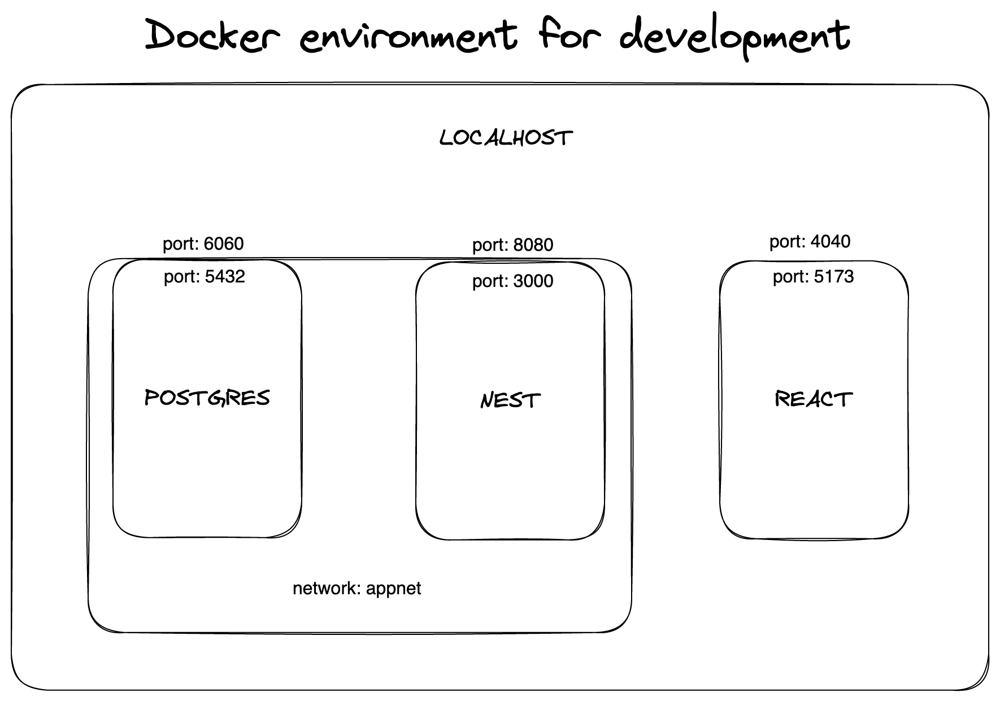

= Transcendence
:nofooter:

== Docker environment for development

[plantuml, target=assets/docker, format=svg, width=100%]
....
rectangle localhost {
	database "our-data" as our_data
	circle "port 8080" as portout_nest
	circle "port 6060" as portout_postgre
	circle "port 4040" as portout_react

	rectangle docker {
		rectangle app-net {
			rectangle NestJS [
				container name: <b>our-backend
				port: <b>3000
				framework: <b>NestJS
			]
			rectangle PostgreSQL {
				circle "port 5432" as portin_postgre
			}
		}
		rectangle React {
			circle "port 5173" as portin_react
		}
	}
}

NestJS -up-> portout_nest
portin_react -up-> portout_react
portin_postgre -up-> portout_postgre
NestJS <-le-> PostgreSQL
....

== Project overview

=== Page 1: Welcome

==== Functionalities:

- Login with the intranet OAuth system 42

==== Technical requirements:

- Communication with OAuth 42

==== Graphical requirements:

- Background, login button 

=== Page 2: Compte utilisateur

==== 2.1 Profile

==== Functionalities:

- You can choose a (unique) username to be displayed on the site. We start with the default name taken from OAuth 42 (?)
- You can upload an avatar. If you don't, it defaults to your 42 profile picture (?)
- You can enable two-factor authentication, 2FA (Google Authenticator or send sms to mobile phone)
- Add other users as friends and view real time status (online, offline, playing, etc.)

==== Technical needs:

- Get via OAuth 42 the photo and name and assign them as default values to AVATAR and USERNAME
- Username, verify that it does not exist as it has to be unique
- Be able to upload a photo as avatar
- Integration of 2FA
- Get user statistics

==== Graphical requirements:

	- Profile window with data: USERNAME (editable), AVATAR (editable), 2FA (on / off)
	- Statistics such as victories and defeats, rank and levels, achievements, etc
	- Button to add friends and see their status

==== 2.2 Match History

==== Functionalities:
	
- Display of history including 1 vs 1, levels and so on. Anyone who is logged in should be able to consult it

==== Technical requirements:	
	
- Get history

==== Graphical requirements:

- Table with history

=== Page 3: Chat

==== Functionalities :

- Create channels (public, private or password protected)
- Send direct messages to other users
- Block other users
- Invite other users to play pong
- Access to other players' profiles

==== Technical requirements:

_To be completed..._
	
==== Graphic requirements:
	
_Design made directly from the description of the subject to optimise time_.

=== Page 4 - The game

==== Functionalities:

- Launch the game of pong against another player
- Matching system (waiting list)
- Canvas with the game
- Customisation options (we have to define which ones)
- The game must be responsive

==== Technical needs:

_To be completed..._

==== Graphic needs:

_Design made directly from the description of the subject to optimize time_.

=== Floating element: menu bar

. Profil 
. Chat
. The game
. LogOut (?)

[plantuml, target=assets/design, format=svg, width=100%]
....
rectangle sections/windows {

	object Page01
	object Page02
	object Page03
	object Page04
	object FloatingElement

	object Welcome {
		Login with the intranet OAuth system 42
		Communication with OAuth 42
	}
	
	object Profile {
		Choose username
		Choose/upload an avatar
		Enable 2FA
		Add users ass friends and view real time status
	}
	
	object MatchHistory{
		Display of history including 1 vs 1
	}
	
	object Chat{
		Create channels
		Send direct messages to other users
		Block other users
		Invite other users to play pong
		Access to other players' profiles
	}
	
	object MenuBar{
		Profil
		Chat
		The game
		LogOut (?)
	}

	object TheGame{
		Launch the game of pong against another player
		Matching system (waiting list)
		Canvas with the game
		Customisation options (we have to define which ones)
		The game must be responsive
	}

	Page01 --> Welcome
	Page02 --> Profile
	Profile --> MatchHistory
	Page03 --> Chat
	Page04 --> TheGame
	FloatingElement --> MenuBar
}
....